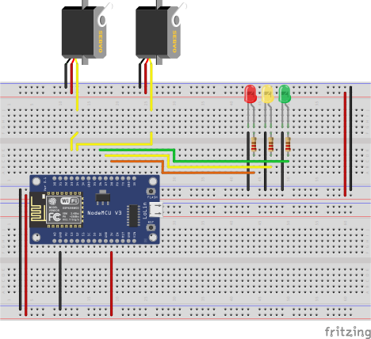

# Sweeper with Leds

A simple arduino project (using nodemcu v3 board) to trainning the usage of C++ OOP and using [`millis()`](https://www.arduino.cc/reference/en/language/functions/time/millis/) instead of `delay()`.

The same project was mounted with Arduino UNO R3 via simul on [ThinkerCad](https://www.tinkercad.com/) and can be accessed on my [ThinkerCad Profile](https://www.tinkercad.com/things/2nX2C2DRXwS?sharecode=6kGq1HvVW2wnS30Y08_kiu4ey7bLjCBtaCB2Yi9OFEk)

## List of components

- Microconcroler board ([arduino uno r3](https://lista.mercadolivre.com.br/arduino-uno-r3#D[A:Arduino%20Uno%20R3]) or [NodeMCU v3](https://lista.mercadolivre.com.br/nodemcu-v3#D[A:NodeMCU%20v3])])
- 3 resistors for protection led (~220Ω)
- 3 leds (many colors)
- 2 servor motors
- jumpers wires or dupont connector jumpers